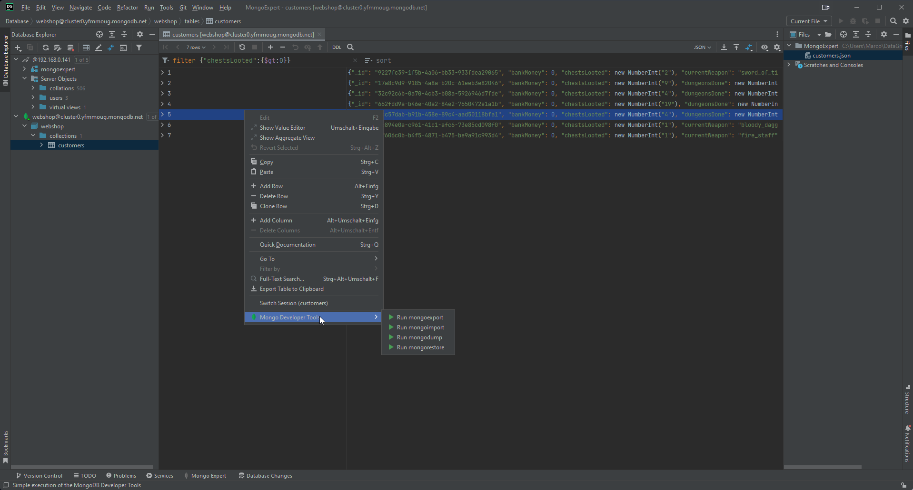

MongoExpert - MongoDB extension plugin for IntelliJ platform IDEs
-----------------------------------------------------------------

#### What is MongoExpert?

The plugin aims to provide improvements and extensions for MongoDB support in Intellij IDEs and Datagrip. For a complete list, see supported IDEs on the plugin page.  

#### Features

*   Import and export of collections.
*   Fast dump and restoring of collections and databases in BSON format.
*   Exporting views in the Database Table Editor.
*   Using tree representation as default for MongoDB collections in the editor.

The settings can be changed via Settings > Tools > Mongo Expert Settings.  
New features can be suggested via the bug tracker.  

#### Getting Started

**Note**: The export and import function requires the installation of MongoDB Developer Tools.

1.  Download and install [MongoDB Command Line Database Tools](https://www.mongodb.com/try/download/database-tools)
2.  Add the installation location to PATH variable
3.  A restart of the system may be required
4.  Launch the IDE and open plugin settings
5.  Search for Mongo Expert and click install

#### What's New

##### Version 2023.1.1

*   Initial release

#### Screenshots and Examples

  
  

#### Feedback & Contact
  
The plugin is still under development and will be equipped with new features.  
In case of problems or missing functions, please do not hesitate to create an isssue.
